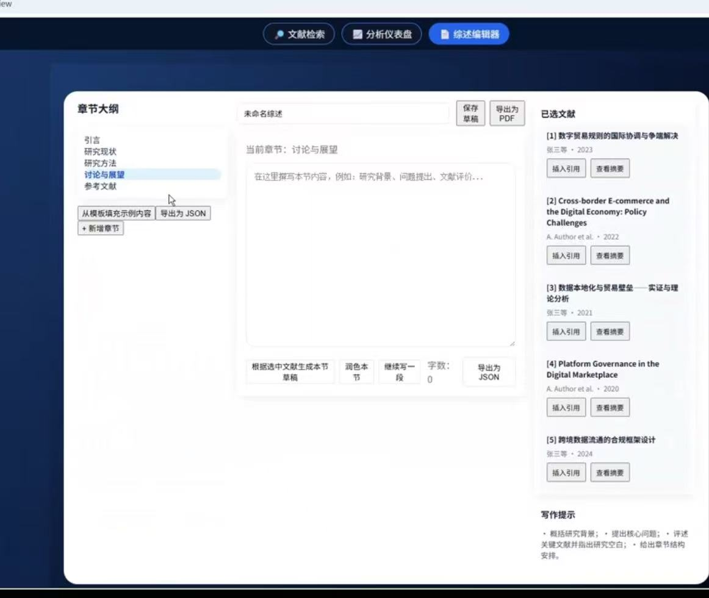

# 文献分析与综述助手 — 分工说明与优化任务分配

> 本文档在组长 CYJ 搭建的原型基础上，按原分工将**三项优化需求**拆解为各成员的具体任务，明确目标、涉及模块与交付物。  
> 原分工：**CYJ** 架构 & Agent & 综述生成（组长）；**ljy** 数据工程 & 检索后端；**JX** NLP & 分析算法；**LRH** 前端 & 可视化 & 交互设计。

---

## 一、现有技术架构与处理流程（简要）

### 1.1 架构分层

```
前端（检索 / 分析仪表盘 / 聊天 / 综述编辑）
        ↓
API 层（FastAPI：/api/search, /api/dashboard/stats, /api/chat, /api/review/*）
        ↓
Agent 层（会话状态、工具调用、RAG、综述生成）
        ↓
检索层（query_understanding, db, es_client, vector_store, search）
        ↓
分析层（CollectionAnalyzer：聚类、共现、趋势、态度演化、仪表盘统计）
        ↓
数据层（discovery, extract, structured_extract, feature_pipeline, import_pipeline, schema）
        ↓
存储（SQLite: papers / paper_structured / paper_features；ES；FAISS 向量索引）
```

### 1.2 端到端处理流程

1. **入库流程**：发现 PDF（discovery）→ PDF 解析与元数据抽取（extract）→ 入库 papers → 结构化摘要（structured_extract）、关键词/态度/方法/向量（feature_pipeline）→ 主题聚类（KMeans 写 topic_id）→ 写 ES、建 FAISS。
2. **检索流程**：用户输入主题/时间 → 查询理解（可选）→ BM25 + 向量检索 → 融合打分与过滤 → 返回列表 + 主题/年份分布。
3. **分析流程**：检索得到的文献集合 → 补全 keywords/vector/attitude → 聚类、共现、趋势、态度演化、仪表盘统计 → 返回前端。
4. **综述/问答**：SessionState + RAG 上下文（结构化摘要等）→ 大模型生成综述或回答。

### 1.3 与优化需求对应的模块

| 优化需求 | 主要涉及模块 |
|----------|--------------|
| ① 优化 PDF 提取、各元数据提取处理 | `data/discovery.py`, `data/extract.py`, `data/normalizers.py`；入库入口 `data/import_pipeline.py` |
| ② 关键词抽取、结构化摘要等（所有前端要展现的内容） | `data/feature_pipeline.py`, `data/structured_extract.py`, `analysis/service.py`；前端各页面与组件 |
| ③ 前端增加「入库新文件」页面，与后端结合 | 新增后端 API（上传、触发导入）；新增前端页面与对接 |

---

## 二、优化需求与成员分工总览

| 成员 | 原分工 | 本次优化任务归属 | 核心目标 |
|------|--------|------------------|----------|
| **ljy** | 数据工程 & 检索后端 | ① PDF 与元数据提取优化；③ 入库功能的后端 API | 提升 PDF 解析与元数据质量；提供「上传并入库」的后端能力 |
| **JX** | NLP & 分析算法 | ② 关键词、结构化摘要、态度/方法、聚类等算法与数据质量 | 提升前端所展示的所有分析结果的质量与可配置性 |
| **LRH** | 前端 & 可视化 & 交互设计 | ② 所有前端展示与交互优化；③ 入库功能的前端页面 | 优化现有页面展示与体验；新增「入库新文件」页面并对接后端 |


---

## 三、ljy：数据工程 & 检索后端 — 详细任务

### 3.1 任务 1：优化 PDF 提取与各元数据提取处理

**目标**：提升 PDF 到结构化元数据的准确率与鲁棒性，减少标题、作者、摘要、关键词、年份、期刊的错抽、漏抽与噪音。

**涉及文件与职责**：

- **`data/extract.py`**
  - 优化 `process_pdf`、`extract_metadata_from_text`：改进标题/作者/摘要/关键词/年份/期刊的识别规则（正则、段落顺序、常见期刊/会议格式）。
  - 优化 `_extract_authors_from_lines`、`_is_likely_author_line`：减少误把「内容提要」「基金项目」等当作者；支持更多作者分隔格式（逗号、顿号、英文 and）。
  - 优化 `_merge_filename_fallback`、`_title_author_from_filename`：在正文解析失败或明显错误时，更好利用「标题_作者.pdf」等文件名信息。
- **`data/normalizers.py`**
  - 优化 `normalize_author`、`normalize_journal`、`normalize_keywords`、`normalize_year`：统一格式、去噪音、截断过长字段，避免入库脏数据。
- **`data/discovery.py`**
  - 若需支持「指定目录入库」或「按来源标签入库」，可扩展 `find_pdfs` 的入参或与入库 API 的目录参数对齐。

**交付物**：

- 更新后的 `extract.py`、`normalizers.py`。
- 简要说明：针对哪几类 PDF（如某期刊、某会议）做了优化，并附 1～2 个「优化前后对比」示例（可写在代码注释或 docs 里）。

**验收标准**：

- 在现有或新增的测试 PDF 集上，标题、作者、摘要、关键词、年份、期刊的抽取完整率与准确率较当前版本有可说明的提升（或列出已知边界与后续计划）。

---

### 3.2 任务 2：入库功能 — 后端 API

**目标**：提供「上传 PDF 并触发入库」的后端能力，供前端「入库新文件」页面调用。

**职责**：

- 设计并实现**上传与入库接口**（建议）：
  - **上传**：接收前端上传的 PDF 文件，落盘到指定目录（如 `data/upload/` 或配置项 `LIT_SOURCE_ROOTS` 下某子目录），可支持「来源标签」（如用户选择的分类/文件夹名）。
  - **入库**：调用现有 `data/import_pipeline` 的单篇或批量逻辑（或封装为「对指定路径/文件列表执行 import」），完成：解析 → 元数据入库 → 可选：结构化摘要 + 特征 + 主题聚类 → 可选：更新 ES/FAISS。
- 考虑**限流、文件大小与类型校验**（如仅允许 .pdf、单文件大小上限），避免恶意上传。
- 返回**任务状态或结果**：如「已接收，正在处理」或「处理完成，成功 N 篇、失败 M 篇及原因」，便于前端展示进度与结果（可与 LRH 约定字段格式）。

**涉及/新增文件**：

- `api/app.py`：新增路由（如 `POST /api/upload`、`POST /api/import` 或合并为「上传即入库」的单一接口）；若入库耗时较长，可先返回任务 ID，再提供 `GET /api/import/status/{task_id}` 等（可选）。
- 若需异步任务，可引入简单队列或后台线程，与 CYJ 确认技术选型。

**交付物**：

- 上述 API 的实现与简要接口文档（路径、请求/响应格式、错误码）。
- 与 LRH 对齐：请求参数（如 source 标签）、响应字段（成功数、失败数、错误信息列表）。

---

### 3.3 检索后端

- 在本次优化中**保持检索层稳定**；若 schema 或字段有变更（如 ljy 在 papers/paper_structured 上增删字段），需与 JX、LRH 同步，并确保 ES/FAISS 索引与 `retrieval/db.py` 的查询仍兼容。

---

## 四、JX：NLP & 分析算法 — 详细任务

### 4.1 任务：关键词抽取、结构化摘要及所有前端展示的分析结果优化

**目标**：提升前端所依赖的**所有分析数据**的质量与可维护性，包括但不限于：关键词、结构化摘要、态度/方法标签、主题聚类与主题名、共现网络、热点演化、态度演化、仪表盘统计。

**涉及文件与职责**：

- **关键词与向量**
  - **`data/feature_pipeline.py`**
    - 优化 `_keybert_extract`：KeyBERT 参数（如 `keyphrase_ngram_range`、`use_mmr`、`diversity`、`top_n`）；针对中英混合与学术文本的停用词或后处理。
    - 优化 `_fallback_keywords`：在 KeyBERT 不可用时的回退策略（分词、去停用词、词频/简单 TF-IDF）。
  - 确保 **SentenceTransformer（EMBED_MODEL）** 的输入（标题+摘要）与现有一致；若 JX 调整 embedding 用法（如分段、截断），需与检索层（vector_store）和聚类输入一致。若此模型效果不好可以选择更换模型

- **结构化摘要**
  - **`data/structured_extract.py`**
    - 优化 `_call_llm_extract`：prompt 设计、字段说明、示例（few-shot）或输出格式约束，以提高背景、研究问题、方法、结论、创新、不足的抽取准确率与格式统一。
    - 优化 `_heuristic_from_abstract`：在无 LLM 或 LLM 失败时的启发式规则，尽量覆盖常见表述。
    - 可选：对 429/限速的重试策略与日志（已在现有代码中有基础实现，可加强可观测性）。

- **态度 / 方法分类**
  - **`data/feature_pipeline.py`**
    - `_classify_attitude`、`_classify_methods`：零样本标签（英文）与中文映射是否贴合领域；必要时扩展候选标签或增加「其他」的判定规则。
  - **`analysis/service.py`** 中的 `SinglePaperProcessor.classify_attitude` 等若与 feature_pipeline 不一致，需统一数据源或接口，避免仪表盘与入库结果不一致。

- **主题聚类与主题名**
  - **`data/import_pipeline.py`** 中的 `_assign_topic_ids`：KMeans 的 `n_clusters`、`random_state`、`n_init` 已存在，可评估是否需根据文献规模做自适应或配置化。
  - **`analysis/service.py`** 的 `perform_clustering`：聚类仍基于**向量**（SentenceTransformer）；**主题名**由簇内关键词 Top2 拼接（见注释「主题名：取前 2 个关键词……」）。可优化：主题名生成规则（如最少出现次数、过滤泛词）、展示长度与分隔符，以便前端展示更清晰。

- **共现网络、热点演化、态度演化、仪表盘统计**
  - **`analysis/service.py`**
    - `build_cooccurrence_network`：min_weight、节点/边的筛选与展示名截断规则；是否需要对关键词做归一化或同义词合并。
    - `analyze_trends`：按年分桶与 Top 关键词数量；时间粒度是否需支持「两年一桶」等（若产品有需求）。
    - `analyze_attitude_evolution`：按年统计态度分布，与 `get_dashboard_stats` 中的态度分布一致；确保与 feature_pipeline 的标签一致。
    - `get_dashboard_stats`：yearlyCounts、topKeywords、attitudeDistribution、researchPathDistribution 的数据来源与计算逻辑清晰，便于 LRH 对接与排错。

**交付物**：

- 更新后的 `feature_pipeline.py`、`structured_extract.py`、`analysis/service.py`（及 import_pipeline 中与聚类相关的参数/注释）。
- 简短说明：针对「关键词、结构化摘要、态度/方法、主题名、共现/趋势/态度演化」做了哪些改动与可调参数（可写在 docs 或代码注释中）。
- 若新增配置项（如主题数、关键词数、共现 min_weight），需在 `config/settings.py` 或环境变量中说明，并与 CYJ 确认。

**验收标准**：

- 前端展示的各类图表与列表（检索页的结构化信息、仪表盘各图、综述引用与 RAG 用的结构化摘要）数据正确、无异常空值或错位；在若干篇样本上的关键词/结构化摘要/态度标签质量有可说明的改进。

---

## 五、LRH：前端 & 可视化 & 交互设计 — 详细任务

### 5.1 任务 1：所有前端体现的功能与展示优化

**目标**：确保**所有后端已提供的数据**在前端正确、友好地展示；优化交互、加载态与错误态，提升可用性与演示效果。

**涉及范围**（与后端字段一一对应）：

- **检索页**（`frontend/src/pages/Search.tsx` 等）
  - 列表与主题分组：results、topicDistribution、yearDistribution。
  - 文献详情：标题、作者、年份、期刊、摘要（含 abstractMeta：关键词、中图分类号等）、structured（背景、研究问题、方法、结论、创新、不足）。
  - 确保 JX 优化后的结构化摘要、关键词等字段有合适展示（折叠/展开、截断、空值处理）。

- **分析仪表盘**（`frontend/src/pages/Dashboard.tsx` 等）
  - 年度发文量、主题聚类分布、关键词 Top10、研究态度分布、研究态度演化、关键词共现网络。
  - 数据来源：`getDashboardStats` 返回的 yearlyCounts、topKeywords、attitudeDistribution、researchPathDistribution、clusters、cooccurrence、trendSeries、attitudeEvolution。
  - 确保 JX 对聚类名、关键词、态度/方法等优化后，前端无需大改即可展示；若有新字段或枚举值，需做兼容或展示映射。

- **综述页**（`frontend/src/pages/Review.tsx`）
  - 综述草稿的章节解析、引用列表（paperIds → getPapersByIds）、AI 对话完善、导出 TXT/LaTeX。
  - 错误与超时提示、加载态统一。

- **聊天侧栏**（`frontend/src/components/ChatSidebar.tsx`）
  - 问答展示、引用文献链接（跳转检索页 paperId）。

**交付物**：

- 对上述页面的必要改动与统一组件/样式；加载与错误态的优化。
- 与 JX 确认：新增或变更的 API 字段在前端的展示方式；与 ljy 确认：入库 API 的请求/响应格式（见下）。

---

### 5.2 任务 2：新增「入库新文件」页面并与后端对接

**目标**：在前端增加一个**新页面**，允许用户上传 PDF 并触发入库，展示进度与结果，与 ljy 提供的后端 API 对接。

**职责**：

- **新页面**（如「文献入库」或「上传文献」）
  - 入口：在主导航中增加链接，路由如 `/import` 或 `/upload`（与现有 `/search`、`/dashboard`、`/review` 并列）。
  - 功能：选择本地 PDF 文件（单文件或多文件）；可选「来源标签」或目标目录（与 ljy 约定的参数一致）；上传并调用后端接口。
  - 展示：上传进度（若后端支持）、入库结果（成功数、失败数、失败原因列表）；可选「最近入库记录」或任务状态查询（若后端提供 status 接口）。
- **与 ljy 对齐**：
  - 接口路径、方法（POST）、请求体（multipart/form-data 或 JSON + 文件）、响应格式（成功/失败条数、错误信息数组）。
  - 错误处理：文件类型错误、大小超限、后端报错时的提示文案。

**涉及/新增文件**：

- 新增页面组件（如 `frontend/src/pages/Import.tsx`）及路由（在 `main.tsx` 或路由配置中注册）。
- 在 `frontend/src/api/index.ts` 中新增调用入库 API 的方法。
- `AppLayout` 等布局中增加「入库」导航项。

**交付物**：

- 可用的「入库新文件」页面；与 ljy 后端联调通过；简要使用说明（可并入现有「使用说明」）。

---
### 5.3 任务 3：优化现有界面（尤其是页面二、页面三）

**目标**：页面三在LRH的视频中如图做的功能比较好，可以延续、完善

**交付物**：

- 确保页面正常可用，功能完善美观；与后端联调通过；简要使用说明（可并入现有「使用说明」）。


## 六、依赖关系与建议顺序

1. **ljy**：先完成 PDF/元数据优化与入库 API 设计（至少接口定稿），再与 LRH 联调入库页面。
2. **JX**：可与 ljy 并行推进；关键词与结构化摘要优化尽早交付，便于前端与 RAG 使用；聚类与主题名、共现/趋势等可紧随其后。
3. **LRH**：前端展示优化可与 JX 的字段变更同步；入库页面依赖 ljy 的 API 定稿后实现与联调。

以上分工与验收清单可根据实际开发进度做小幅调整，调整时请更新本文档并同步到仓库。注意！每个人都在自己的GitHub分支上更新代码，等确认代码无误后在拉到主线上。
